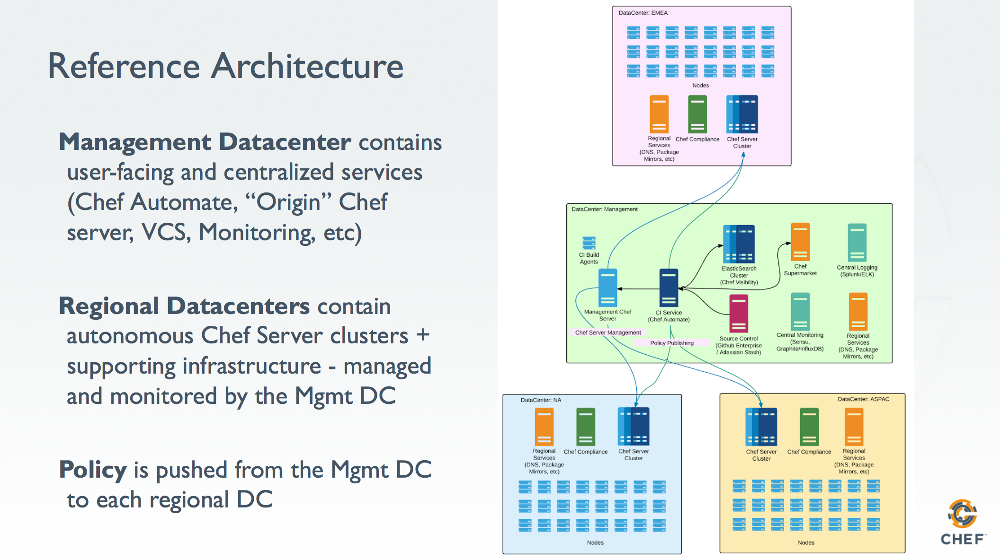

# chef_infra Cookbook

This cookbook provides an example implementation of a reference architecture capable of being used as a global deployment reference for Chef Software, Inc.'s products and add-ons including, but not limited to:

- Chef Server 12
- Chef Compliance Server
- Chef Automate
- Chef Push Jobs Server
- Supermarket

It will perform component installation and configuration for an end-to-end integrated topology. It relies on the [chef_stack](https://github.com/ncerny/chef_stack) library cookbook to provide the underlying resources needed. Environment/Role/or Wrapper cookbooks should be created using the recipes that this cookbook provides, controlling component configuration entirely through attributes.

### Platforms Tested
- CentOS 7

### Chef Client
- Chef 12.x

### Cookbooks
- chef_stack
- chef_vault

## Usage

The demonstrates spinning up a Backended cluster in AWS from a Managed Chef account.
```
git clone https://github.com/jeremymv2/chef_infra.git
cd chef_infra
./scripts/backend_cluster.sh
```
### Topology

Desired Sequence of provisioning and convergence:

1. Chef Management Master (standalone.rb)
2. Elastic Search cluster (search.rb)
3. Chef Automate server (automate.rb)
4. Supermarket (supermarket.rb)
5. Workflow Builders (workflow_builder.rb)
6. Regional Backend Bootstrap (backend.rb)
7. Regional Backend members (backend.rb)
8. Regional Frontend Bootstrap (frontend.rb)
9. Regional Frontend members (frontend.rb)

The reason for the sequence affinity is due to secret sharing amongst the nodes.


